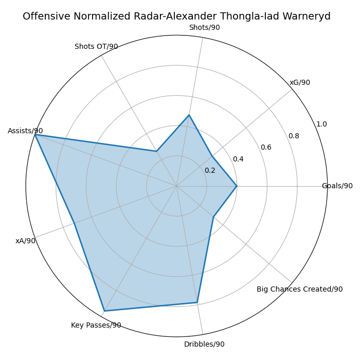
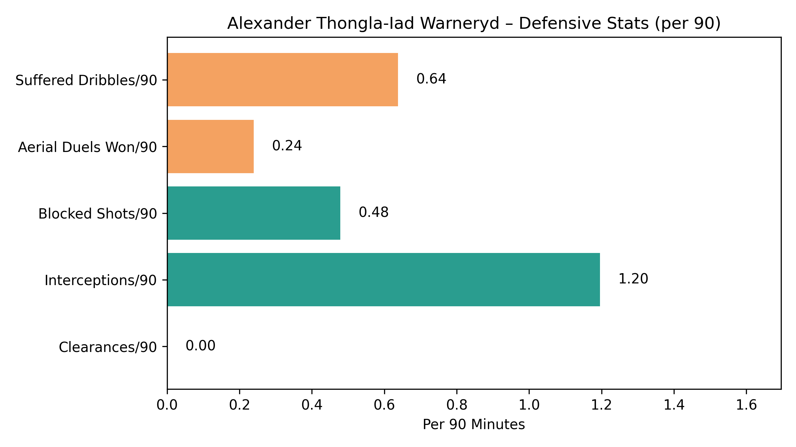
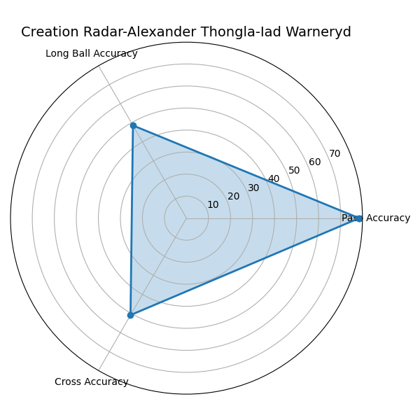

<table style="border: none;">
  <tr>
    <td width="160" style="border: none;">
      
    </td>
    <td style="border: none;" valign="middle">
      <h1 style="margin: 0;">
        Scouting Report: 
        Alexander Thongla-Iad Warneryd (2025)
      </h1>
    </td>
  </tr>
</table>

  Report date: 27-06-2025 | Author: Simão Paulo Brito

<!-- Subtitle: Role and Club-->

  📍 Role: Right Wing-Back / Winger

  🏟️ Club: Västerås SK (🇸🇪 Superettan)

<!-- 1. Introduction -->
<h1>1. Introduction</h1>

  

    Alexander Thongla-Iad Warneryd is a dynamic 19-year-old right wing-back and winger 
    currently playing for Västerås SK in Sweden’s second tier, the Superettan. Known for 
    his attacking instincts and versatility, he operates primarily as a wide player in a 
    3-5-2 system but can also be deployed as an inverted winger on the left.
  

  

    The purpose of this report is to analyze Alexander's recent performances and development 
    using a combination of match data, visual breakdowns, and tactical context. This scouting 
    report focuses primarily on his 2025 season, highlighting both statistical output and 
    qualitative aspects of his play style.
  

  

    The data used in this report covers competitive appearances during the 2025 season, 
    up to June 2025. All statistics and visuals are sourced from publicly available 
    match footage, performance databases, and club-level reports where applicable.
  

---

<!-- 2. Player Profile -->
<h1>2. Player Profile</h1>

  

    <strong>👤 Full Name:</strong> Alexander Rickard Chadchai Thongla-Iad Warneryd
  

  

    <strong>📍 Role:</strong> Right Wing-Back / Winger in 3-5-2 (can also play as an Inverted Winger on the left)
  

  

    <strong>🏟️ Club:</strong> Västerås SK (🇸🇪 Superettan)
  

  

    <strong>📅 Age:</strong> 19 years old
  

  

    <strong>🌍 Nationality:</strong> 🇸🇪 Swedish and 🇹🇭 Thai
  

  

    <strong>📏 Height:</strong> 1.74 m
  

  

    <strong>📊 2025 Season (as of June):</strong> 13 matches | 1129 minutes | 2 Goals | 6 Assists
  

  

    <strong>💰 Market Value:</strong> 1.00M €
  

  

    <strong>📝 Contract Until:</strong> 31/12/2027
  

---

<h1>3. Notable Achievements in 2025 Superettan</h1>
<ul style="font-size: 14px; padding-left: 18px; line-height: 1.6;">
  <li>🥇 <strong>1st</strong> in assists</li>
  <li>🥉 <strong>3rd</strong> in assists per 90 minutes</li>
  <li>🏅 <strong>4th</strong> in total goal contributions (goals + assists)</li>
</ul>

---

<!-- 4. Summary of Key Findings -->
<h1>4. Summary of Key Findings</h1>

<h2>✅ Strengths</h3>
  <ul style="margin-top: 4px; padding-left: 18px;">
    <li><strong>🔁 Dribbling:</strong> <strong>4.70</strong> successful dribbles per 90 minutes (<strong>80% success</strong>) – strong 1v1 ability and confidence on the ball.</li>
    <li><strong>📩 Crossing:</strong> <strong>50.80% accuracy</strong> – outstanding delivery into the box; elite numbers.</li>
    <li><strong>🎯 Key Passes:</strong> 1.91 per 90 – consistently involved in creating chances.</li>
    <li><strong>🎯 Pass Accuracy:</strong> 78.40% – reliable distribution, especially in attacking zones.</li>
    <li><strong>🎁 Chance Creation:</strong> Despite a modest 0.16 big chances created per 90, his assist count (6) and creative metrics suggest strong impact in chance generation.</li>
    <li><strong>🛡️ Interceptions:</strong> 1.20 per 90 – indicates good anticipation, positioning and reading of play when out of possession.</li>
  </ul>

<h2>⚠️ Weaknesses & Limitations</h3>
  <ul style="margin-top: 4px; padding-left: 18px;">
    <li><strong>🚫 Clearances:</strong> 0 – shows limited involvement in deep defensive actions; may reflect tactical positioning - in a 3-5-2 system he usually stays higher or defends space rather than the box.</li>
    <li><strong>🪂 Aerial Duels Won:</strong> 0.24 per 90 – weak aerial contribution, likely due to his 1.74m height and physical profile.</li>
    <li><strong>🧱 Defensive Output:</strong> Other defensive stats are unremarkable, suggesting limited contribution when defending deep or in 1v1 duels.</li>
  </ul>

<h2>🧐 Stats Requiring Context</h3>
  <ul style="margin-top: 4px; padding-left: 18px;">
    <li><strong>🚷 Blocked Shots:</strong> 0.48 per 90 – not necessarily low for his role; depends on tactical shape and positioning.</li>
    <li><strong>🕴️ Dribbled Past:</strong> 0.64 per 90 – moderate value; not worrying on its own, but worth tracking depending on matchups and pressure situations.</li>
  </ul>

<h2>📌 Tactical Fit Insight</h3>

  While his defensive weaknesses are notable, they can be tactically compensated when paired with a defensively solid right-sided centre-back in a back three. His profile is best suited to systems with wing-backs (e.g., 3-5-2 or 3-4-3), where he can focus on attacking transitions and wide creativity. 
  <strong>He may struggle as a full-back in a traditional back four</strong>, where more defensive reliability is expected. In such systems, an alternative could be testing him as an <strong>inverted left winger</strong>, where his technical ability and creativity can be maximized in tighter spaces.

---

<h1>5. Offensive Performance</h1>

  <!-- Stat List -->
  <ul style="margin: 0; padding-left: 18px; flex: 1; line-height: 2;">
    <li><strong>Goals:</strong> 2</li>
    <li><strong>Goals per 90:</strong> 0.16</li>
    <li><strong>Expected Goals (xG):</strong> 1.35</li>
    <li><strong>xG per 90:</strong> 0.11</li>
    <li><strong>Goals minus xG:</strong> +0.65</li>
    <li><strong>Goals minus xG per 90:</strong> +0.05</li>
    <li><strong>Shots per 90:</strong> 0.32</li>
    <li><strong>Successful Dribbles per 90:</strong> 4.70</li>
    <li><strong>Dribble Success Rate:</strong> 80%</li>
    <li><strong>Key Passes per 90:</strong> 1.91</li>
    <li><strong>Big Chances Created per 90:</strong> 0.16</li>
    <li><strong>Assists:</strong> 6</li>
    <li><strong>Assists per 90:</strong> 0.48</li>
    <li><strong>Expected Assists (xA):</strong> 3.17</li>
    <li><strong>xA per 90:</strong> 0.25</li>
    <li><strong>Assists minus xA:</strong> +2.83</li>
    <li><strong>Assists minus xA per 90:</strong> +0.23</li>
  </ul>

  <!-- Radar Chart Image -->
  

---

<h1>6. Defensive Performance</h1>

  <!-- Stat List -->
  <ul style="margin: 0; padding-left: 18px; flex: 1; line-height: 2.4;">
    <li><strong>Interceptions:</strong> 15 (1.20 per 90)</li>
    <li><strong>Blocked Shots:</strong> 6 (0.48 per 90)</li>
    <li><strong>Suffered Dribbles:</strong> 8 (0.64 per 90)</li>
    <li><strong>Aerial Duels Won:</strong> 3 (0.24 per 90)</li>
    <li><strong>Clearances:</strong> 0</li>
    <li><strong>Errors Leading to Goal:</strong> 0</li>
  </ul>

  <!-- Bar Chart -->
  

---

<h1>7. Creation Performance</h1>

  <!-- Stat List -->
  <ul style="margin: 0; padding-left: 18px; flex: 1; line-height: 2.8;">
    <li><strong>Accurate passes:</strong> 424</li>
    <li><strong>Accurate passes per 90:</strong> 33.80</li>
    <li><strong>Pass accuracy:</strong> 78.40%</li>
    <li><strong>Accurate long balls:</strong> 35</li>
    <li><strong>Accurate long balls per 90:</strong> 2.79</li>
    <li><strong>Long ball accuracy:</strong> 48.60%</li>
    <li><strong>Accurate crosses:</strong> 32</li>
    <li><strong>Accurate crosses per 90:</strong> 2.55</li>
    <li><strong>Cross accuracy:</strong> 50.80%</li>
  </ul>

  <!-- Radar Chart Image -->
  

---

<h1>8. Conclusion</h1>

  

    Alexander Thongla-Iad Warneryd emerges as a highly dynamic wide player with standout attacking contribution and technical consistency in the final third. His profile is shaped by elite-level metrics in <strong>dribbling (4.70 per 90)</strong>, <strong>crossing accuracy (50.8%)</strong>, and <strong>key passes (1.91 per 90)</strong>, all of which point toward a player capable of regularly creating high-quality chances — as reflected in his <strong>6 assists</strong> and a positive <strong>Assists-xA delta (+2.83)</strong>.
  

  

    Defensively, however, his numbers are much more limited. His <strong>0 clearances</strong>, <strong>low aerial duel success (0.24 per 90)</strong>, and modest <strong>defensive volume stats</strong> suggest that he would likely struggle as a traditional full-back in a back four. That said, he could be tactically optimized in a <strong>right wing-back role in a 3-5-2</strong>, especially when covered by a defensively solid right-sided centre-back. In systems like these, his weaknesses can be masked, and his offensive upside can be maximized.
  

  

    At just <strong>19 years old</strong>, with dual nationality (🇸🇪 Swedish & 🇹🇭 Thai), and already contributing at a high level in the Superettan, his current market value of <strong>€1.00M</strong> appears justified — and potentially undervalued if development continues at this rate. Alexander should be considered a high-upside profile for clubs looking to invest in vertical, creative wide players with room to grow — particularly in systems that allow him the freedom to push forward and focus on his final-third impact.
  

---

<h1>9. Data Sources & Thanks</h1>

This analysis relies on data from:
- SofaScore
- FBRef
- Transfermarkt

Thanks to these platforms for providing detailed statistics and player data.

### Notable achievements in 2025 Superettan

- 🥇 1st in assists
- 🥉 3rd in assists per 90 minutes
- 🏅 4th in goal contributions (combined goals + assists)
